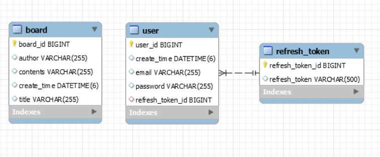

# wanted-pre-onboarding-backend
wanted-pre-onboarding-backend

## 지원자명
강수나

## 애플리케이션 실행 방법

1. 사용한 툴
   - Java 17
   - SpringBoot
   - MySQL 8.0
   - JPA
2. BackApplication 실행 후 엔드포인트 api 호출

엔드포인트 호출 방법은 아래와 같습니다.

---

**과제 1. 사용자 회원가입 엔드포인트**

- URL: localhost:8080/user/join (POST)

```
{
    "email" : "aaaa@gmail.com",
    "password" : "test!!!123123123"
}
```

**과제 2. 사용자 로그인 엔드포인트**

- URL: localhost:8080/user/login (POST)

```
{
    "email" : "aaaa@gmail.com",
    "password" : "test!!!123123123"
}
```


**과제 3. 새로운 게시글을 생성하는 엔드포인트**

- URL: localhost:8080/board (POST)
- 헤더의 Authorization 사용
```
{
    "title" : "제목입니다~",
    "contents" : "내용입니다~"
}
```

**과제 4. 게시글 목록을 조회하는 엔드포인트**

- URL: localhost:8080/board?page=0 (GET)

**과제 5. 특정 게시글을 조회하는 엔드포인트**

- URL: localhost:8080/board/1 (GET)

**과제 6. 특정 게시글을 수정하는 엔드포인트**

- URL: localhost:8080/board (PUT)
- 헤더의 Authorization 사용
```
{
    "id" : 1,
    "title" : "수정된 제목입니다~",
    "contents" : "수정된 내용입니다~",
    "author" : "aaaa@gmail.com"
}
```

**과제 7. 특정 게시글을 삭제하는 엔드포인트**

- URL: localhost:8080/board/1 (DELETE)
- 헤더의 Authorization 사용

## 데이터베이스 테이블 구조


## 데모 영상 링크
**과제 1. 사용자 회원가입 엔드포인트**


https://github.com/acrnm148/wanted-pre-onboarding-backend/assets/67724306/1a1b7cc8-7193-44f1-8031-1d1d2483dc25


**과제 2. 사용자 로그인 엔드포인트**


https://github.com/acrnm148/wanted-pre-onboarding-backend/assets/67724306/7f72e6f3-f17e-43c8-9f2b-7d0a062e97a0


**과제 3. 새로운 게시글을 생성하는 엔드포인트**


https://github.com/acrnm148/wanted-pre-onboarding-backend/assets/67724306/8501e76a-af90-44cd-9b69-7f8de62e3407


**과제 4. 게시글 목록을 조회하는 엔드포인트**


https://github.com/acrnm148/wanted-pre-onboarding-backend/assets/67724306/e3469bbb-70ff-4f16-a755-e00c7ab62c53


**과제 5. 특정 게시글을 조회하는 엔드포인트**


https://github.com/acrnm148/wanted-pre-onboarding-backend/assets/67724306/71a07b2a-ada4-436e-b778-46b004fbaa9d


**과제 6. 특정 게시글을 수정하는 엔드포인트**


https://github.com/acrnm148/wanted-pre-onboarding-backend/assets/67724306/86b814e3-da1f-457a-96ca-26488ad0431c


**과제 7. 특정 게시글을 삭제하는 엔드포인트**


https://github.com/acrnm148/wanted-pre-onboarding-backend/assets/67724306/4d249427-8aa8-41fe-a54b-f6c398ac1e0a


## 구현 방법 및 이유


## API 명세


[//]: # (### docker-compose 실행 방법)

[//]: # (### 배포된 API 주소)

[//]: # (### 설계한 AWS 환경)


